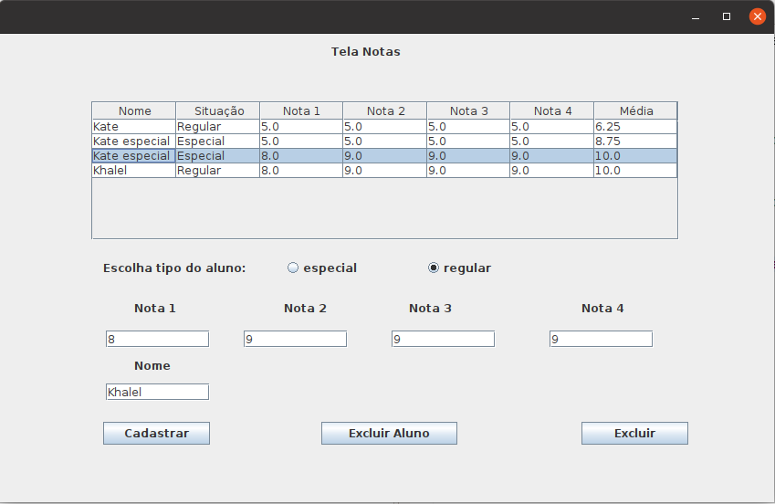
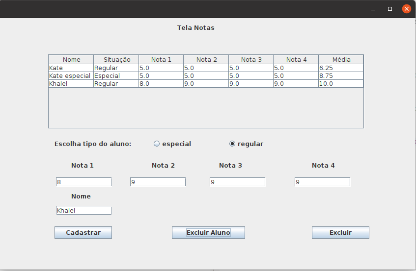

# Exercício 1 - Paradigma de programação (SistemaEscolaPOO)

------

1. Use o window builder para construção da Tela;
2. Use o polimorfismo eherança (recursos do POO)
3. Utilize cálculos diferentes para dois tipos de alunos(Regulares e Especiais)
5. Mostre o resultado a partir dessa escolha.

## Requisitos
1. Para Aluno regular calcule a média das notas e multiplique o resultado final por 1.25
2. Para Aluno Especial calcule a média das notas e multiplique o resultado final por 1.75
3. Necessário usar Herança e polimorfismo
4. Crie Três Classes para representar o Aluno (Super Classe) e Subclasses (AlunoRegular eAlunoEspecial)
5. Criar visualização com JFrame
6. Modelar inclusa e exclusão em JTable

## Resultados

     
    
    <h5 align="center">Figura 1 - Tela com cadastro de alunos e notas.</h5>
     

     
    
    <h5 align="center">Figura 2 - Tela com exclusão de alunos.</h5>
     

